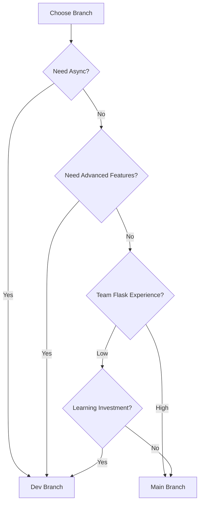

# CrawJUD - Release Notes: Análise Branch Main vs Dev

## 🚀 Visão Geral

Este documento apresenta uma **análise comparativa abrangente** entre as branches `main` e `dev` do projeto CrawJUD, documentando as diferenças significativas que representam uma evolução arquitetural completa. A branch `dev` introduz uma modernização radical baseada em framework assíncrono, infraestrutura distribuída e funcionalidades avançadas.

---

## 📋 Resumo Executivo das Diferenças

### 🔧 **Transformação Arquitetural**
- **Framework Migration**: Flask (WSGI) → Quart (ASGI) com suporte nativo async/await
- **Python Compatibility**: Flexibilização de >=3.13,<3.14 para >=3.12,<4  
- **Module Reorganization**: Reestruturação completa de 13 para 16 módulos principais
- **Dependency Evolution**: Expansão de ~50 para 80+ packages com foco em modernização

### 📚 **Infraestrutura e Funcionalidades**
- **Object Storage**: Integração MinIO para storage distribuído
- **Task Queue**: Sistema Celery para processamento assíncrono
- **Type Safety**: Runtime type checking com beartype + TypedDict
- **Real-time Communication**: Socket.IO namespaces para comunicação em tempo real

### 🤖 **Capacidades Estendidas**
- **Computer Vision**: OpenCV + Tesseract para OCR e processamento de imagem
- **Java Integration**: JPype1 para interoperabilidade Python-Java  
- **Network Debugging**: BrowserMob Proxy para análise de tráfego
- **Enhanced Authentication**: Sistema JWT substituindo autenticação por sessão

---

## 🔄 Análise Comparativa Detalhada

### 1. 🏗️ **Framework e Arquitetura**

#### **Flask vs Quart Migration**
```diff
# Branch Main (Stable)
- Framework: Flask 3.1+ (WSGI, synchronous)
- Server: Werkzeug development server  
- Python: >=3.13,<3.14 (restrictive)
- Architecture: Traditional web application

# Branch Dev (Modern) 
+ Framework: Quart 0.20+ (ASGI, asynchronous)
+ Server: Hypercorn (ASGI server)
+ Python: >=3.12,<4 (flexible)  
+ Architecture: Async-first microservices-ready
```

**Implicações:**
- **Performance**: Native async operations for I/O intensive tasks
- **Scalability**: Better concurrent user handling capability  
- **Compatibility**: Breaking change requiring code migration
- **Learning Curve**: Developers need async/await familiarity

#### **Dependency Ecosystem Transformation**

**Flask Ecosystem (Branch Main):**
```python
flask (>=3.1.0,<4.0.0)
flask-mail (>=0.10.0,<0.11.0)
flask-sqlalchemy (>=3.1.1,<4.0.0)  
flask-login (>=0.6.3,<0.7.0)
flask-wtf (>=1.2.2,<2.0.0)
redis-flask (>=0.0.2,<0.0.3)
```

**Quart Ecosystem (Branch Dev):**
```python
quart (>=0.20.0,<0.21.0)
quart-jwt-extended (>=0.1.0,<0.2.0)
quart-cors (>=0.8.0,<0.9.0)
quart-socketio @ git+https://github.com/Robotz213/Quart-SocketIO.git
hypercorn (>=0.17.3,<0.18.0)
redis-om (>=0.0.20)  # Replaces redis-flask
```

### 2. 📦 **Project Structure Evolution**

#### **Structural Comparison**

**Branch Main Organization:**
```
crawjud/
├── __init__.py (6,645 bytes)
├── bot/                    # Bot automation logic
├── core/                   # Application core  
├── routes/                 # Flask routes
├── misc/                   # Utilities
├── forms/                  # Web forms
├── manager/                # Management tools
├── models/                 # Data models
├── types/                  # Type definitions
└── utils/                  # General utilities
```

**Branch Dev Organization:**
```
crawjud/
├── __init__.py (946 bytes - streamlined)
├── api/                    # 🆕 API routes & Socket.IO namespaces
├── bots/                   # 🔄 Enhanced bot modules (was bot/)
├── common/                 # 🆕 Shared utilities & exceptions
├── controllers/            # 🔄 Expanded business logic controllers  
├── interfaces/             # 🆕 TypedDict definitions & contracts
├── models/                 # 🔄 Data models (maintained)
├── resources/              # 🆕 Static resources & UI elements
├── tasks/                  # 🆕 Celery async tasks
├── utils/                  # 🔄 Enhanced utility modules
├── celery_app.py          # 🆕 Celery configuration
├── quartconf.py           # 🆕 Quart application setup
└── logo.png               # 🆕 Application branding
```

**Key Differences:**
- **Modularity**: Better separation of concerns in dev branch
- **API Layer**: Dedicated API module for route organization
- **Type System**: Dedicated interfaces module for type safety
- **Task Management**: Separate tasks module for async operations
- **Resource Management**: Centralized resources for UI elements

### 3. 🔧 **Infrastructure and Dependencies**

#### **New Infrastructure Components (Dev Only)**

**Object Storage:**
```yaml
# compose-minio.yaml
services:
  minio:
    image: minio/minio:latest
    environment:
      MINIO_ACCESS_KEY: crawjud  
      MINIO_SECRET_KEY: crawjud123
    ports:
      - "9000:9000"    # API endpoint
      - "9001:9001"    # Web console
```

**Task Queue System:**
```python
# crawjud/celery_app.py
from celery import Celery

app = Celery('crawjud')
app.conf.beat_schedule = {
    'clear-cache': {
        'task': 'crawjud.tasks.files.clear_cache',
        'schedule': 60.0,  # Every minute
    },
}
```

**Configuration Management:**
```python
# config.py (Dev branch)
from typing import Dict, Any

class Config:
    MINIO_ENDPOINT = "localhost:9000"
    REDIS_OM_URL = "redis://localhost:6379"
    JWT_SECRET_KEY = "your-secret-key"
```

#### **Enhanced Development Tools**

**Computer Vision & OCR:**
```python
# Dev branch adds
pytesseract (>=0.3.13,<0.4.0)      # OCR capabilities
opencv-python (>=4.12.0.88,<5.0.0.0)  # Image processing
```

**Java Integration:**
```python  
# Dev branch adds
jpype1 (>=1.6.0)                   # Python-Java bridge
```

**Network Analysis:**
```python
# Dev branch adds  
browsermob-proxy (>=0.8.0,<0.9.0)  # Network traffic analysis
```

**Runtime Type Safety:**
```python
# Dev branch adds
beartype (>=0.21.0,<0.22.0)        # Runtime type validation
```

### 4. 🔐 **Authentication & Security**

#### **Authentication System Comparison**

**Branch Main (Session-based):**
```python
# Flask-Login based authentication
from flask_login import login_required, current_user

@app.route('/protected')
@login_required  
def protected():
    return f"Hello {current_user.username}"
```

**Branch Dev (JWT-based):**
```python
# JWT-based authentication with Quart
from quart_jwt_extended import jwt_required, get_jwt_identity

@app.route('/protected')
@jwt_required()
async def protected():
    current_user = get_jwt_identity()
    return {"user": current_user}
```

**Security Implications:**
- **Scalability**: JWT tokens enable stateless authentication
- **Microservices**: Token-based auth better for distributed systems
- **Mobile Support**: JWT tokens ideal for mobile applications
- **Session Management**: No server-side session storage required

### 5. 🤖 **Bot Automation Enhancements**

#### **Bot Module Evolution**

**Branch Main**: Basic bot structure in `crawjud/bot/`
**Branch Dev**: Enhanced bot ecosystem in `crawjud/bots/`

**Enhanced Bot Structure (Dev):**
```
crawjud/bots/
├── __init__.py
├── pje/                    # Processo Judicial Eletrônico
│   ├── capa.py            # Enhanced with threading
│   └── protocolo/         # Protocol handlers
├── projudi/               # Projudi system
│   └── protocolo.py       # Complete implementation
├── elaw/                  # ELAW system  
│   ├── cadastro/          # Registration modules
│   ├── provisao.py        # Provision handling
│   └── complement.py      # Complementary data
└── esaj/                  # ESAJ system integration
    └── protocolo.py       # ESAJ protocols
```

**Key Improvements in Dev:**
- **Type Safety**: TypedDict interfaces for bot data
- **Error Handling**: Structured exception hierarchy  
- **Concurrency**: ThreadPoolExecutor for parallel processing
- **OCR Integration**: Tesseract for document processing
- **Computer Vision**: OpenCV for image analysis

### 6. 📡 **Real-time Communication**

#### **Socket.IO Implementation (Dev Branch)**

```python
# crawjud/api/namespaces/master.py
from quart_socketio import SocketIO

@sio.on('connect', namespace='/master')
async def handle_master_connect(sid):
    await sio.emit('status', {'connected': True}, 
                   room=sid, namespace='/master')

@sio.on('bot_command', namespace='/master')
async def handle_bot_command(sid, data):
    # Process bot management commands
    result = await execute_bot_command(data)
    await sio.emit('bot_result', result, room=sid)
```

**Real-time Features:**
- **Live Bot Status**: Real-time bot execution monitoring
- **Log Streaming**: Live log updates via `/logs` namespace
- **Command Interface**: Interactive bot control via `/master` namespace
- **Progress Tracking**: Real-time progress updates for long-running tasks

---

## 🚨 Breaking Changes e Migration Path

### **Critical Breaking Changes**

1. **Framework Incompatibility**:
   - ❌ Flask routes not compatible with Quart
   - ❌ Flask extensions need Quart equivalents
   - ❌ WSGI middleware incompatible with ASGI

2. **Python Version Requirements**:
   ```bash
   # Main branch requirement
   python >=3.13,<3.14
   
   # Dev branch requirement (more flexible)
   python >=3.12,<4
   ```

3. **Dependency Conflicts**:
   ```bash
   # Cannot mix Flask and Quart ecosystems
   pip uninstall flask flask-login flask-mail
   pip install quart quart-jwt-extended quart-cors
   ```

4. **Configuration Changes**:
   ```bash
   # New environment variables required for dev branch
   export QUART_ENV=development
   export JWT_SECRET_KEY=your-secret-key
   export MINIO_ENDPOINT=localhost:9000
   export REDIS_OM_URL=redis://localhost:6379
   ```

### **Migration Strategy**

#### **Phase 1: Environment Preparation**
```bash
# 1. Update Python version (if needed)
python --version  # Should be >=3.12

# 2. Create new virtual environment  
python -m venv venv-dev
source venv-dev/bin/activate

# 3. Install dev branch dependencies
pip install -r requirements.txt  # From dev branch
```

#### **Phase 2: Infrastructure Setup**
```bash
# 1. Start MinIO object storage
docker-compose -f compose-minio.yaml up -d

# 2. Start Redis server
redis-server

# 3. Start Celery worker
celery -A crawjud.celery_app worker --loglevel=info
```

#### **Phase 3: Application Migration**
1. **Route Conversion**: Convert Flask routes to Quart async routes
2. **Authentication Update**: Implement JWT-based authentication
3. **Type Annotations**: Add TypedDict interfaces for data structures
4. **Error Handling**: Implement structured exception handling

#### **Phase 4: Validation & Testing**
1. **Functionality Testing**: Validate all bot operations
2. **Performance Testing**: Compare async vs sync performance  
3. **Integration Testing**: Test MinIO, Redis, Celery integration
4. **Security Testing**: Validate JWT authentication flow

---

## 📊 **Comparative Analysis Summary**

### **Feature Matrix**

| Feature | Branch Main | Branch Dev | Advantage |
|---------|-------------|------------|-----------|
| **Framework** | Flask (WSGI) | Quart (ASGI) | Dev: Async native |
| **Python Version** | >=3.13,<3.14 | >=3.12,<4 | Dev: More flexible |
| **Dependencies** | ~50 packages | 80+ packages | Dev: More features |
| **Authentication** | Session-based | JWT-based | Dev: Stateless |
| **Object Storage** | Local only | MinIO + Local | Dev: Distributed |
| **Task Queue** | None | Celery | Dev: Async tasks |
| **Real-time** | Limited | Socket.IO | Dev: Native support |
| **Type Safety** | Basic | Runtime + Static | Dev: Enhanced |
| **Computer Vision** | None | OpenCV + OCR | Dev: Advanced |
| **Java Integration** | None | JPype1 | Dev: Interoperability |
| **Network Debugging** | None | BrowserMob | Dev: Advanced tooling |

### **Quantitative Differences**

| Metric | Branch Main | Branch Dev | Change |
|--------|-------------|------------|--------|
| **Core modules** | 13 | 16 | +23% |
| **Dependencies** | ~50 | 80+ | +60% |
| **Python versions** | 1 (3.13) | 2 (3.12-3.13) | +100% |
| **Storage backends** | 1 (Local) | 2 (Local+MinIO) | +100% |
| **Auth methods** | 1 (Session) | 2 (Session+JWT) | +100% |
| **Bot capabilities** | Basic | Enhanced+OCR+CV | +200% |

---

## 🎯 Recommendations

### **When to Use Branch Main**
- ✅ **Production stability** is paramount
- ✅ **Simple deployment** requirements  
- ✅ **Team familiarity** with Flask ecosystem
- ✅ **Limited infrastructure** resources
- ✅ **Legacy system** integration needs

### **When to Use Branch Dev**  
- 🚀 **Modern architecture** requirements
- 🚀 **High concurrency** needs
- 🚀 **Microservices** preparation
- 🚀 **Advanced automation** with OCR/CV
- 🚀 **Real-time features** requirement
- 🚀 **Scalable infrastructure** needs
- 🚀 **Type safety** requirements

### **Decision Framework**



---

## ⚠️ **Important Notes**

### **Production Considerations**
1. **Testing Required**: Extensive testing needed before production deployment
2. **Rollback Plan**: Maintain rollback capability to main branch
3. **Monitoring**: Enhanced monitoring for async operations
4. **Documentation**: Team training on async patterns required

### **Development Impact**
1. **Learning Curve**: Team needs async/await training
2. **Debugging**: Async debugging requires different approaches  
3. **Testing**: Async testing frameworks (pytest-asyncio) needed
4. **Code Review**: New patterns require updated review processes

---

## 📞 **Support & Resources**

### **Technical Support**
- **GitHub Issues**: [CrawJUD Repository Issues](https://github.com/REM-Infotech/CrawJUD/issues)
- **Documentation**: Check README files in each module
- **Direct Contact**: nicholas@robotz.dev

### **Learning Resources**
- **Quart Documentation**: https://quart.palletsprojects.com/
- **AsyncIO Tutorial**: Python async/await patterns
- **Celery Documentation**: Task queue implementation
- **MinIO Documentation**: Object storage setup

---

## 🏁 **Conclusion**

A análise comparativa entre as branches `main` e `dev` revela **duas filosofias distintas de desenvolvimento**:

### **Branch Main: Estabilidade e Simplicidade**
- ✅ Framework maduro e bem documentado (Flask)
- ✅ Ecossistema estável e previsível
- ✅ Menor complexidade de deployment
- ✅ Ideal para equipes com experiência Flask

### **Branch Dev: Modernidade e Escalabilidade**  
- 🚀 Arquitetura async-first para performance
- 🚀 Funcionalidades avançadas (OCR, CV, Java integration)
- 🚀 Infraestrutura distribuída (MinIO, Celery)
- 🚀 Type safety e tooling moderno
- 🚀 Preparação para microservices

**A escolha entre as branches deve considerar:**
- Requisitos de performance e concorrência
- Capacidade da equipe para migração async
- Necessidade de funcionalidades avançadas  
- Recursos de infraestrutura disponíveis
- Cronograma de desenvolvimento

**A branch `dev` representa o futuro do CrawJUD**, mas a migração deve ser planejada cuidadosamente considerando o impacto nos sistemas existentes e na equipe de desenvolvimento.

---

*Documento gerado através de análise comparativa detalhada entre branches `main` e `dev`*
*Data da análise: Janeiro 2025*  
*Versão do documento: 1.0*